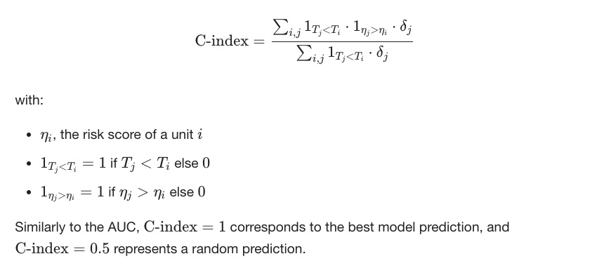

# Overview

In this competition, you’ll develop models to improve the prediction of transplant survival rates for patients undergoing allogeneic Hematopoietic Cell Transplantation (HCT) — an important step in ensuring that every patient has a fair chance at a successful outcome, regardless of their background.

# Description

Improving survival predictions for allogeneic HCT patients is a vital healthcare challenge. Current predictive models often fall short in addressing disparities related to socioeconomic status, race, and geography. Addressing these gaps is crucial for enhancing patient care, optimizing resource utilization, and rebuilding trust in the healthcare system.

This competition aims to encourage participants to advance predictive modeling by ensuring that survival predictions are both precise and fair for patients across diverse groups. By using synthetic data—which mirrors real-world situations while protecting patient privacy—participants can build and improve models that more effectively consider diverse backgrounds and conditions.

You’re challenged to develop advanced predictive models for allogeneic HCT that enhance both accuracy and fairness in survival predictions. The goal is to address disparities by bridging diverse data sources, refining algorithms, and reducing biases to ensure equitable outcomes for patients across diverse race groups. Your work will help create a more just and effective healthcare environment, ensuring every patient receives the care they deserve.

# Evaluation

## Evaluation Criteria

The evaluation of prediction accuracy in the competition will involve a specialized metric known as the Stratified Concordance Index (C-index), adapted to consider different racial groups independently. This method allows us to gauge the predictive performance of models in a way that emphasizes equitability across diverse patient populations, particularly focusing on racial disparities in transplant outcomes.

## Concordance index

It represents the global assessment of the model discrimination power: this is the model’s ability to correctly provide a reliable ranking of the survival times based on the individual risk scores. It can be computed with the following formula:



The concordance index is a value between 0 and 1 where:

- 0.5 is the expected result from random predictions,
- 1.0 is a perfect concordance and,
- 0.0 is perfect anti-concordance (multiply predictions with -1 to get 1.0)

## Stratified Concordance Index

For this competition, we adjust the standard C-index to account for racial stratification, thus ensuring that each racial group's outcomes are weighed equally in the model evaluation. The stratified c-index is calculated as the mean minus the standard deviation of the c-index scores calculated within the recipient race categories, i.e., the score will be better if the mean c-index over the different race categories is large and the standard deviation of the c-indices over the race categories is small. This value will range from 0 to 1, 1 is the theoretical perfect score, but this value will practically be lower due to censored outcomes.

The submitted risk scores will be evaluated using the score function. This evaluation process involves comparing the submitted risk scores against actual observed values (i.e., survival times and event occurrences) from a test dataset. The function specifically calculates the stratified concordance index across different racial groups, ensuring that the predictions are not only accurate overall but also equitable across diverse patient demographics.

```py
"""
To evaluate the equitable prediction of transplant survival outcomes,
we use the concordance index (C-index) between a series of event
times and a predicted score across each race group.
 
It represents the global assessment of the model discrimination power:
this is the model’s ability to correctly provide a reliable ranking
of the survival times based on the individual risk scores.
 
The concordance index is a value between 0 and 1 where:
 
0.5 is the expected result from random predictions,
1.0 is perfect concordance (with no censoring, otherwise <1.0),
0.0 is perfect anti-concordance (with no censoring, otherwise >0.0)

"""
import pandas as pd
import pandas.api.types
import numpy as np
from lifelines.utils import concordance_index

class ParticipantVisibleError(Exception):
    pass


def score(solution: pd.DataFrame, submission: pd.DataFrame, row_id_column_name: str) -> float:
    """
    >>> import pandas as pd
    >>> row_id_column_name = "id"
    >>> y_pred = {'prediction': {0: 1.0, 1: 0.0, 2: 1.0}}
    >>> y_pred = pd.DataFrame(y_pred)
    >>> y_pred.insert(0, row_id_column_name, range(len(y_pred)))
    >>> y_true = { 'efs': {0: 1.0, 1: 0.0, 2: 0.0}, 'efs_time': {0: 25.1234,1: 250.1234,2: 2500.1234}, 'race_group': {0: 'race_group_1', 1: 'race_group_1', 2: 'race_group_1'}}
    >>> y_true = pd.DataFrame(y_true)
    >>> y_true.insert(0, row_id_column_name, range(len(y_true)))
    >>> score(y_true.copy(), y_pred.copy(), row_id_column_name)
    0.75
    """
    
    del solution[row_id_column_name]
    del submission[row_id_column_name]
    
    event_label = 'efs'
    interval_label = 'efs_time'
    prediction_label = 'prediction'
    for col in submission.columns:
        if not pandas.api.types.is_numeric_dtype(submission[col]):
            raise ParticipantVisibleError(f'Submission column {col} must be a number')
    # Merging solution and submission dfs on ID
    merged_df = pd.concat([solution, submission], axis=1)
    merged_df.reset_index(inplace=True)
    merged_df_race_dict = dict(merged_df.groupby(['race_group']).groups)
    metric_list = []
    for race in merged_df_race_dict.keys():
        # Retrieving values from y_test based on index
        indices = sorted(merged_df_race_dict[race])
        merged_df_race = merged_df.iloc[indices]
        # Calculate the concordance index
        c_index_race = concordance_index(
                        merged_df_race[interval_label],
                        -merged_df_race[prediction_label],
                        merged_df_race[event_label])
        metric_list.append(c_index_race)
    return float(np.mean(metric_list)-np.sqrt(np.var(metric_list)))
```

# Dataset Description

The dataset consists of 59 variables related to hematopoietic stem cell transplantation (HSCT), encompassing a range of demographic and medical characteristics of both recipients and donors, such as age, sex, ethnicity, disease status, and treatment details. The primary outcome of interest is event-free survival, represented by the variable `efs`, while the time to event-free survival is captured by the variable `efs_time`. These two variables together encode the target for a censored time-to-event analysis. The data, which features equal representation across recipient racial categories including White, Asian, African-American, Native American, Pacific Islander, and More than One Race, was synthetically generated using the data generator from synthcity, trained on a large cohort of real CIBMTR data.

# Files
- train.csv - the training set, with target efs (Event-free survival)
- test.csv - the test set; your task is to predict the value of efs for this data
- sample_submission.csv - a sample submission file in the correct format with all predictions set to 0.50
- data_dictionary.csv - a list of all features and targets used in dataset and their descriptions

Note: The rerun test data contains approximately the same number of observations as the training data.
